# Hipótesis y Experimentos — Ciencia y Fe

Supuestos riesgosos del MVP Canvas convertidos en hipótesis falsables.
Ordenados de mayor a menor riesgo: **primero se prueba lo que más puede tumbar el MVP**.

```mermaid
flowchart TD
  classDef test fill:#E2EAF3,stroke:#1A4E8A,color:#0E1A26;
  classDef ok   fill:#E3F1E8,stroke:#2E7D52,color:#0E1A26;
  classDef no   fill:#F6E2DD,stroke:#B3402F,color:#0E1A26;

  H1[H-01: migración BD · riesgo alto]:::test
  H2[H-02: capacidad del equipo · riesgo alto]:::test
  H3[H-03: formato aceptado por distrito · riesgo medio]:::test
  H4[H-04: estabilidad lineamientos Ministerio · riesgo medio]:::test
  H5[H-05: adopción secretaria · riesgo bajo]:::test

  H1 -->|pasa: 100 % migrado| K1[Esquema centralizado\npara todos los cursos]:::ok
  H1 -->|falla| V1[Pivotar: vistas\nsobre esquema viejo]:::no

  H2 -->|pasa: ≥ 85 % US comprometidas| K2[Sprint completo\nUS-01 a US-07]:::ok
  H2 -->|falla| V2[Pivotar: scope reducido\nUS-01, US-02, US-03]:::no

  H3 -->|pasa: 0 observaciones formato| K3[Desplegar template\na todos los cursos]:::ok
  H3 -->|falla| V3[Corregir/descartar\ntemplate actual]:::no

  H4 -->|pasa: 0 circulares de cambio| K4[Diseñar con\nescalas actuales]:::ok
  H4 -->|falla| V4[Actualizar diseño\nantes de construir]:::no

  H5 -->|pasa: ≥ 80 % reportes directos| K5[Desplegar\nsin ajustes]:::ok
  H5 -->|falla| V5[Pivotar: vista\ncomparativa transitoria]:::no
```

---

### [H-01] Viabilidad de migración del esquema de BD — riesgo: alto

- **Supuesto a probar:** El esquema actual de la BD puede migrarse a una estructura centralizada sin pérdida de datos históricos de calificaciones y sin bloquear la operación normal durante el proceso.
- **Hipótesis:** Creemos que el Desarrollador podrá migrar los datos de calificaciones de al menos un curso completo al nuevo esquema centralizado sin pérdida de registros, si ejecuta un spike técnico de mapeo y migración en ambiente de prueba, porque aunque la BD está fragmentada, los datos de calificaciones deben estar en tablas consultadas por los SP actuales.
- **Señal medible:** Porcentaje de registros de calificaciones del curso piloto recuperados íntegramente en el esquema nuevo versus el esquema original.
- **Criterio de éxito:** 100 % de registros migrados sin discrepancias en un máximo de 5 días laborables.
- **Experimento:** Spike técnico — mapear todas las tablas con calificaciones del sistema actual, ejecutar migración piloto de un curso en ambiente de prueba y comparar registros origen/destino fila por fila.
- **Caja de tiempo/costo:** 5 días laborables de 1 desarrollador; sin costo adicional de infraestructura.
- **Regla de decisión:** Si pasa (100 % migrado en 5 días) → continuar con el esquema centralizado para todos los cursos. Si falla (pérdida de datos o tiempo insuficiente) → pivotar: diseñar vistas sobre el esquema viejo en lugar de migración completa.

---

### [H-02] Capacidad del equipo para entregar antes del cierre — riesgo: alto

- **Supuesto a probar:** El equipo de dos desarrolladores tiene capacidad real para entregar las seis funcionalidades mínimas del MVP antes del cierre del ciclo 2025-2026, mientras mantiene el sistema actual en paralelo.
- **Hipótesis:** Creemos que los dos desarrolladores podrán comprometer una fecha de entrega para las 7 user stories dentro del ciclo actual, si descomponen cada historia en tareas técnicas y comparan con su capacidad disponible descontando mantenimiento del sistema viejo, porque la urgencia está identificada y la rectora ya priorizó los reportes de cierre.
- **Señal medible:** Porcentaje de user stories del MVP comprometidas con fecha de entrega anterior al cierre del ciclo 2025-2026.
- **Criterio de éxito:** Al menos el 85 % de las 7 user stories comprometidas antes del cierre, confirmado en 2 días de planificación.
- **Experimento:** Sesión de estimación (planning) de 2 días — descomponer las 7 US en tareas, estimarlas con el equipo y comparar con horas disponibles descontando las horas de mantenimiento del sistema viejo.
- **Caja de tiempo/costo:** 2 días de los 2 desarrolladores; sin costo adicional.
- **Regla de decisión:** Si pasa (≥ 85 % comprometidas antes del cierre) → iniciar el sprint con el scope completo. Si falla (menos del 85 % cabe en el tiempo disponible) → pivotar: negociar con la rectora un scope reducido a US-01, US-02 y US-03 para el cierre urgente y diferir US-04 a US-07 a la siguiente iteración.

---

### [H-03] Aceptación formal del reporte dinámico por el distrito — riesgo: medio

- **Supuesto a probar:** El formato de reporte generado dinámicamente será aceptado formalmente por el distrito y el Ministerio sin requerir cambios de formato no anticipados.
- **Hipótesis:** Creemos que la Secretaria obtendrá la aceptación formal del distrito para los reportes del nuevo sistema, si se valida un prototipo con la secretaria y se consulta informalmente al distrito antes de la entrega masiva, porque los reportes actuales (con datos quemados) son aceptados en cuanto a su formato base, lo que sugiere que el contenido dinámico no altera la estructura formal.
- **Señal medible:** Número de observaciones formales de formato emitidas por el distrito sobre el reporte piloto (sin contar errores de contenido).
- **Criterio de éxito:** 0 observaciones formales de formato sobre el reporte piloto en 3 días de revisión previa al cierre.
- **Experimento:** Revisión previa con prototipo — generar 1 cuadro de calificaciones dinámico de un curso piloto, revisarlo con la secretaria y consultar informalmente al distrito antes de la entrega oficial masiva.
- **Caja de tiempo/costo:** 3 días (1 desarrollador + secretaria); sin costo adicional.
- **Regla de decisión:** Si pasa (0 observaciones de formato) → desplegar el template para todos los cursos. Si falla (observaciones de formato) → corregir el template antes de la entrega masiva; si las correcciones son estructurales, escalar con la rectora y descartar el diseño actual del template.

---

### [H-04] Estabilidad de los lineamientos del Ministerio durante el desarrollo — riesgo: medio

- **Supuesto a probar:** Las escalas de calificación y los formatos de reporte exigidos por el Ministerio de Educación no cambiarán durante el período de desarrollo del MVP.
- **Hipótesis:** Creemos que el equipo podrá diseñar el esquema de BD y las plantillas sin cambios estructurales imprevistos, si revisa la última circular o resolución oficial del Ministerio antes de comenzar el desarrollo, porque los cambios ministeriales se anuncian en documentos oficiales con antelación y el ciclo lectivo ya está en curso.
- **Señal medible:** Número de circulares o resoluciones del Ministerio que alteren los formatos de reporte o las escalas de calificación publicadas entre el inicio del MVP y el cierre del ciclo.
- **Criterio de éxito:** 0 circulares que modifiquen los requisitos del MVP, verificado en 1 día de revisión documental.
- **Experimento:** Revisión documental (1 día) — consultar el portal oficial del Ministerio de Educación del Ecuador y revisar las últimas 3 circulares o resoluciones sobre escalas y formatos de reporte académico.
- **Caja de tiempo/costo:** 1 día (1 persona, no necesariamente un desarrollador); sin costo adicional.
- **Regla de decisión:** Si pasa (sin circulares que alteren el scope) → diseñar el esquema con las escalas y formatos actuales. Si falla (existe un cambio reciente no incorporado) → actualizar el diseño antes de construir; si el cambio es estructural, descartar el esquema actual y rediseñar antes de avanzar.

---

### [H-05] Adopción directa del nuevo sistema por la secretaria — riesgo: bajo

- **Supuesto a probar:** La secretaria abandonará el flujo del sistema antiguo y confiará en los reportes del nuevo sistema para entregarlos al distrito directamente, sin verificación manual paralela que anule el ahorro de tiempo.
- **Hipótesis:** Creemos que la Secretaria enviará los reportes del nuevo sistema al distrito sin verificarlos manualmente contra el sistema viejo, si el primer reporte generado coincide con sus expectativas en una sesión de validación guiada, porque su dolor principal es el reproceso y las inconsistencias, y un sistema que las elimina le da incentivo para confiar en él.
- **Señal medible:** Porcentaje de reportes del cierre 2025-2026 enviados al distrito directamente desde el nuevo sistema, sin generación paralela en el sistema viejo.
- **Criterio de éxito:** ≥ 80 % de los reportes de cierre enviados directamente desde el nuevo sistema, medido al finalizar el período de entrega al distrito.
- **Experimento:** Sesión de validación guiada (2 horas) — generar un reporte de prueba con la secretaria presente, compararlo con el del sistema viejo en pantalla y registrar su nivel de confianza y su intención de uso directo.
- **Caja de tiempo/costo:** 2 horas (secretaria + 1 desarrollador); sin costo adicional.
- **Regla de decisión:** Si pasa (secretaria declara intención de usar el nuevo sistema directamente) → desplegar sin ajustes. Si falla (secretaria insiste en verificar manualmente contra el sistema viejo) → pivotar: ofrecer una vista comparativa entre ambos sistemas durante el período de transición hasta que la confianza se consolide.
