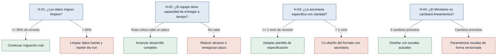

# Hipótesis y experimentos — Ciencia y Fe

Supuestos riesgosos del MVP Canvas convertidos en hipótesis falsables,
ordenados de mayor a menor riesgo.

---

## Árbol de decisión general

---

### [H-01] Limpieza de datos en la migración — riesgo: alto

- **Supuesto a probar:** La migración de calificaciones del esquema fragmentado
  actual al esquema centralizado puede realizarse sin pérdida ni corrupción de
  datos.
- **Hipótesis:** Creemos que el equipo de desarrollo podrá migrar el 100% de los
  registros de calificaciones sin pérdida ni error de integridad, si realiza una
  auditoría de las tablas fuente y un dry-run de migración sobre una copia del
  esquema antiguo, porque si los datos en origen tienen inconsistencias
  estructurales ningún script de migración las resolverá automáticamente.
- **Señal medible:** Porcentaje de registros de calificaciones migrados
  correctamente sin errores de integridad referencial respecto al total de
  registros en el sistema antiguo.
- **Criterio de éxito:** 95% o más de los registros migrados sin errores de
  integridad en un ciclo de prueba de 3 días.
- **Experimento:** Auditoría de datos + migración en seco (dry run) — ejecutar el
  script de migración sobre una copia del esquema antiguo y comparar el conteo y
  los valores de calificaciones antes y después. Tipo: prototipo técnico desechable.
- **Caja de tiempo/costo:** Máximo 3 días de trabajo técnico sin costo adicional
  (usa datos y entorno propios).
- **Regla de decisión:** Si pasa (>= 95% sin errores) → continuar con la
  migración real al esquema nuevo. Si falla → auditar las tablas fuente para
  identificar inconsistencias, agregar scripts de limpieza al plan y repetir el
  dry-run antes de migrar en producción.

---

### [H-02] Capacidad del equipo para entregar en plazo — riesgo: alto

- **Supuesto a probar:** El equipo de dos desarrolladores puede completar el
  módulo de reportes dinámicos y la migración de BD antes del cierre del período
  2025-2026, trabajando en paralelo con las entregas urgentes actuales.
- **Hipótesis:** Creemos que el equipo de dos desarrolladores completará el módulo
  de reportes dinámicos dentro del plazo del período 2025-2026, si se desglosan
  las tareas en unidades de 2 días y se traza una ruta crítica explícita, porque
  sin un plan detallado no es posible detectar a tiempo si el ritmo actual lleva a
  un incumplimiento.
- **Señal medible:** Número de días de retraso acumulado sobre la ruta crítica del
  módulo al finalizar la primera semana de desarrollo activo.
- **Criterio de éxito:** 0 días de retraso acumulado al cierre de la primera
  semana de desarrollo; la ruta crítica cabe en el plazo real disponible.
- **Experimento:** Sprint de estimación de 1 día — los dos desarrolladores
  desglosan las tareas del módulo en sub-tareas de máximo 2 días, estiman la ruta
  crítica y la comparan con la fecha límite real del cierre de período. Tipo:
  entrevista / sesión de estimación conjunta.
- **Caja de tiempo/costo:** 1 día de trabajo conjunto de los dos desarrolladores.
- **Regla de decisión:** Si pasa (ruta crítica cabe en el plazo) → arrancar el
  desarrollo con el alcance completo del MVP. Si falla → pivotar: reducir el
  alcance del MVP (posponer lógica de escalas complejas o nómina de abanderados)
  o negociar con la rectora un plazo mayor antes de comprometerse.

---

### [H-03] Calidad de especificación de requerimientos de secretaría — riesgo: medio

- **Supuesto a probar:** La secretaria puede especificar los requerimientos de
  formato de los reportes con suficiente claridad para que los desarrolladores los
  implementen sin reversiones.
- **Hipótesis:** Creemos que la secretaria aprobará un prototipo de reporte con un
  máximo de 1 ciclo de revisión, si se le presenta una plantilla de especificación
  estructurada con campos predefinidos (nombres de materias, escalas, ubicación de
  firmas y sellos, jerarquía visual), porque el historial de reversiones evidenciado
  proviene de requerimientos ambiguos, no de incompetencia técnica.
- **Señal medible:** Número de ciclos de revisión necesarios para que la secretaria
  apruebe el primer prototipo de reporte sin cambios pendientes.
- **Criterio de éxito:** 1 o menos ciclos de revisión para aprobación del prototipo
  en un plazo de 5 días hábiles.
- **Experimento:** Mago de Oz / Concierge — presentar a la secretaria un borrador
  de reporte generado con datos reales (incluso en Word o PDF manual) y recoger su
  feedback usando una plantilla de especificación estructurada.
- **Caja de tiempo/costo:** Máximo 2 días: 1 para preparar el borrador + 1 para la
  sesión de revisión con la secretaria.
- **Regla de decisión:** Si pasa (<= 1 ciclo) → adoptar la plantilla de
  especificación como proceso estándar para futuros cambios. Si falla → realizar
  una sesión de co-diseño del formato con la secretaria antes de implementar, y
  documentar los criterios de aceptación de forma más granular.

---

### [H-04] Estabilidad de lineamientos del Ministerio — riesgo: medio

- **Supuesto a probar:** Los lineamientos académicos del Ministerio de Educación
  no cambiarán durante el ciclo de desarrollo del módulo, de modo que las escalas
  y formatos diseñados serán válidos al momento de la entrega.
- **Hipótesis:** Creemos que los lineamientos vigentes del Ministerio se mantendrán
  estables durante el ciclo de desarrollo (máximo 3 meses), si se verifica la fecha
  de la última actualización oficial y se consulta con la rectora si hay cambios
  previstos para el período 2025-2026, porque actuar sobre lineamientos ya
  desactualizados invalida el trabajo de plantillas.
- **Señal medible:** Número de cambios de lineamientos oficiales del Ministerio de
  Educación notificados o publicados durante los 3 meses de desarrollo del módulo.
- **Criterio de éxito:** 0 cambios de lineamientos notificados en los próximos 3
  meses según la consulta inicial.
- **Experimento:** Entrevista dirigida a la rectora sobre la agenda de cambios del
  Ministerio, complementada con revisión del portal oficial de Educación para
  detectar circulares o resoluciones pendientes. Tipo: entrevista / consulta
  dirigida.
- **Caja de tiempo/costo:** Máximo 2 horas de consulta.
- **Regla de decisión:** Si pasa (0 cambios previstos) → diseñar las plantillas
  con las escalas actuales vigentes. Si falla → diseñar las plantillas con un
  mecanismo de configuración de escalas versionado, priorizando la parametrización
  sobre la codificación directa.
