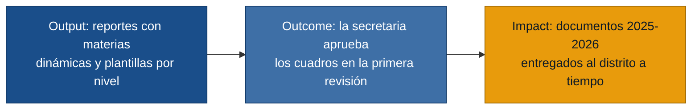

# MVP Canvas — Módulo de Reportes Académicos (cienciayfe)

---

## MVP Canvas — Módulo de Reportes Académicos

| Bloque | Contenido |
|---|---|
| **Propuesta de valor** | Eliminar el ciclo de devoluciones de cuadros extrayendo los nombres de las materias dinámicamente desde la base de datos y unificando las plantillas por nivel, de modo que un cambio en un solo lugar se refleje consistentemente en cuadros trimestrales, finales y actas de promoción. |
| **Segmento de usuarios** | Secretaria (valida y entrega los reportes al distrito) y Desarrollador (genera y mantiene los reportes). La Rectora es beneficiaria directa del resultado pero no es usuaria del módulo. |
| **Funcionalidades mínimas** | 1. Tabla maestra de materias por nivel en la base de datos (fuente única de verdad). 2. Extracción dinámica del nombre de cada materia desde esa tabla en cuadros trimestrales, finales y actas de promoción. 3. Plantilla de cuadro parametrizada por nivel educativo (una plantilla por nivel, no por curso). 4. Escala de calificaciones por nivel: cualitativa (AA+/A-/B-) para básica 1.°-4.°, cuantitativa (numérica) para 5.° en adelante. 5. Espacio para firma del docente y dos sellos (colegio y distrito) en todo reporte. |
| **Resultado esperado (outcome)** | La secretaria aprueba los cuadros de calificaciones y actas de promoción del período 2025-2026 en la primera revisión, sin necesidad de devolver ningún reporte por inconsistencia en nombres de materias ni por errores de layout. |
| **Métrica de éxito** | Porcentaje de cuadros aprobados por la secretaria en la primera revisión ≥ 90 % durante el primer ciclo de entrega al distrito (período 2025-2026). Si esa cifra sube, la rectora puede confirmar si el sistema está listo para entregar al distrito sin retrabajo. |
| **Riesgos / supuestos** | 1. Los nombres de materias en la base de datos actual son correctos y completos (si no, la extracción dinámica muestra datos incorrectos). 2. Es posible centralizar las calificaciones de todos los niveles en una tabla maestra sin perder datos del período en curso. 3. El Ministerio de Educación no cambia el formato de los cuadros antes del cierre del año escolar 2025-2026. |
| **Fuera de alcance (por ahora)** | Nómina de estudiantes abanderados 2026-2027 (siguiente período, no urgente aún). Consolidación del sistema interno y externo en una sola plataforma (decisión estratégica de mediano plazo). Migración completa al nuevo stack tecnológico (Java/Spring Boot/PostgreSQL). CI/CD y despliegue en nuevos servidores Ubuntu. Cumplimiento formal de la LOPDP (se abordará en el sistema nuevo). Canal formal de registro de requerimientos (mejora de proceso, no de sistema). |
