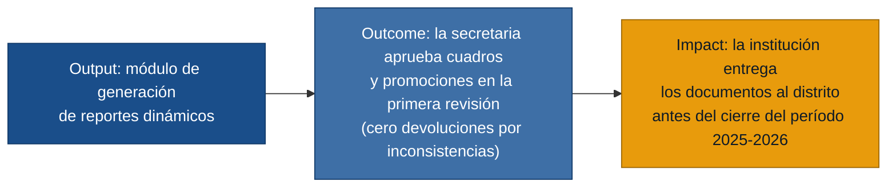

# MVP Canvas — Módulo de reportes académicos dinámicos (Ciencia y Fe)

---

## Cadena de valor

---

## Canvas

| Bloque | Contenido |
|---|---|
| **Propuesta de valor** | Generar cuadros de calificaciones (trimestrales y finales) y reportes de promoción correctos y consistentes desde una fuente única de datos, eliminando las correcciones manuales entre reportes y los valores hardcoded en plantillas. |
| **Segmento de usuarios** | Secretaria (revisa y envía los reportes), Desarrollador (construye y mantiene), Rectora (supervisa y valida ante el distrito). |
| **Funcionalidades mínimas** | 1. Esquema de BD centralizado con tabla unificada de calificaciones para todos los cursos. 2. Motor de reportes con plantilla única parametrizable por nivel y curso (sin RDLC duplicados). 3. Nombres de materias leídos dinámicamente desde BD (sin hardcoding). 4. Lógica de escalas de calificación y comportamiento por nivel educativo. 5. Espacios de firma (docente) y sellos (colegio, distrito) integrados en la plantilla. |
| **Resultado esperado (outcome)** | La secretaria aprueba los cuadros y reportes de promoción del período 2025-2026 en el primer ciclo de revisión, sin devoluciones por inconsistencias de nombres de materias o layout roto entre reportes. |
| **Métrica de éxito** | Número de devoluciones de reportes por inconsistencias entre cuadros durante el cierre del período 2025-2026: de la cantidad actual (múltiples ciclos de revisión observados en entrevistas) a **0 devoluciones por inconsistencias de datos o layout** en el cierre del período siguiente. |
| **Riesgos / supuestos** | 1. La migración de calificaciones del esquema fragmentado actual al esquema centralizado es limpia y completa (supuesto de mayor riesgo). 2. El equipo de dos desarrolladores puede entregar el módulo antes del cierre del período 2025-2026 trabajando en paralelo con las entregas urgentes actuales. 3. El Ministerio de Educación no cambia los lineamientos de calificación durante la construcción. 4. La secretaria puede especificar los requerimientos de formato con suficiente detalle para evitar reversiones. |
| **Fuera de alcance (por ahora)** | Módulo financiero. Módulo de talento humano. Nómina de abanderados 2026-2027 (prioridad siguiente, no del cierre actual). Consolidación del sistema externo con el interno. Reestructuración de la página web institucional. Módulo de autenticación/roles (ya en construcción como infraestructura separada). |
