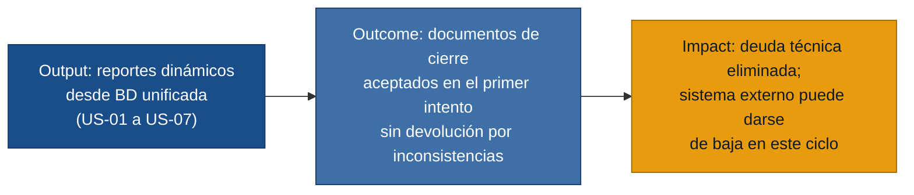

# MVP Canvas — Sistema de Reportes Académicos Ciencia y Fe

---

| Bloque | Contenido |
|---|---|
| **Propuesta de valor** | Generación automática y coherente de cuadros de calificaciones (trimestral, quimestral y final) y reportes de promociones del ciclo 2025-2026, con nombres de materias obtenidos de una BD unificada, sin datos quemados ni llenado por posicionamiento. |
| **Segmento de usuarios** | Secretaria (genera y entrega los reportes), Desarrollador (mantiene y extiende el sistema), Rectora (aprueba y responde ante el distrito y el Ministerio). |
| **Funcionalidades mínimas** | 1. Esquema centralizado de calificaciones en la BD — R-07 (prerequisito de todo lo demás). 2. Generación dinámica de cuadros trimestrales, quimestrales y finales — R-01, R-02. 3. Generación dinámica del reporte de promociones con nombres desde la BD — R-03. 4. Espacios de firma del docente y sellos en todos los reportes — R-04. 5. Escala de calificación diferenciada por nivel (cualitativa/numérica) — R-05. 6. Plantilla parametrizada compartida entre todos los cursos — R-06. |
| **Resultado esperado (outcome)** | La secretaria genera los documentos de cierre 2025-2026 en un solo intento sin devolverlos por errores de materias o inconsistencias; los desarrolladores aplican una corrección estructural en minutos, no en semanas. |
| **Métrica de éxito** | Tasa de aceptación en el primer intento de los reportes de cierre 2025-2026 ≥ 90 % (sin devolución por errores de materias o inconsistencias), medida en la entrega formal al distrito al finalizar el ciclo. — *Prueba ácida: si sube al 90 %, la Rectora puede decidir dar de baja el sistema externo en este ciclo; si no, no puede.* |
| **Riesgos / supuestos** | 1. La BD actual puede migrarse a un esquema centralizado sin pérdida de datos históricos de calificaciones. 2. Los lineamientos actuales del Ministerio son suficientemente estables para diseñar el esquema inicial sin adaptabilidad inmediata. 3. El equipo (dos desarrolladores) tiene capacidad para entregar las seis funcionalidades mínimas antes del cierre del ciclo 2025-2026. |
| **Fuera de alcance (por ahora)** | • **Unificación del sistema interno y externo (R-09):** se aborda solo tras validar que los reportes son correctos; derribar el sistema externo antes bloquea la operación. • **Nómina de abanderados (R-08):** no es bloqueante para el cierre; se incorpora en la siguiente iteración. • **Proceso formal de solicitud de cambios (R-10):** se mantiene informal hasta que el MVP esté estable; formalizar antes añade fricción sin valor inmediato. • **Adaptación configurable a cambios del Ministerio (R-13):** la flexibilidad total se diseña una vez que el esquema centralizado esté en producción. • **Cumplimiento Ley de Protección de Datos (R-11):** no hay señal de auditoría urgente; se planifica como tarea de cumplimiento separada. |
