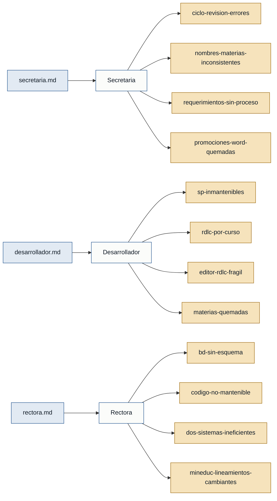

# Personas — discovery cienciayfe

---

## Personas

### Secretaria — secretaria

- **Contexto:** Funcionaria de secretaría que gestiona y valida los cuadros de calificaciones, actas de promoción y documentos oficiales que el colegio envía al distrito educativo.
- **Objetivo principal:** Obtener reportes académicos correctos, con información consistente entre sí y con el formato exigido por el Ministerio de Educación, para entregarlos a tiempo al distrito.
- **Dolores:**
  - Arreglar un cuadro daña otro; ciclo interminable de devoluciones y correcciones. (secretaria.md)
  - Los nombres de las materias no coinciden entre el cuadro de calificaciones, el cuadro final y el de promociones. (secretaria.md)
  - No existe un proceso formal para comunicar requerimientos de cambio; los malentendidos generan retrabajo de semanas. (secretaria.md)
  - Las plantillas de promoción en Word tienen materias quemadas y se llenan por posicionamiento, sin lógica robusta; son frágiles ante cualquier cambio. (secretaria.md)
- **Respaldo:** `primera mano` (secretaria.md)

---

### Desarrollador — desarrollador

- **Contexto:** Desarrollador(es) que mantiene el sistema académico actual (.NET ASP / SQL Server) y, en paralelo, construye la infraestructura del sistema nuevo (Java / Spring Boot / PostgreSQL).
- **Objetivo principal:** Entregar los reportes urgentes del período 2025-2026 y sentar las bases de un sistema nuevo mantenible que elimine la deuda técnica acumulada.
- **Dolores:**
  - Stored Procedures de hasta 30 000 líneas con IFs anidados, no reutilizables; arreglar uno puede dañar otro. (desarrollador.md)
  - Cada curso tiene su propio RDLC; cualquier cambio requiere modificar múltiples archivos de forma manual. (desarrollador.md)
  - El editor RDLC no es amigable: mover un elemento desplaza todo el layout. (desarrollador.md)
  - Los nombres de las materias están quemados en el RDLC y no coinciden con los de la base de datos, lo que impide hacer los reportes dinámicos. (desarrollador.md)
- **Respaldo:** `primera mano` (desarrollador.md)

---

### Rectora — rectora

- **Contexto:** Autoridad institucional que define prioridades, supervisa a los desarrolladores y establece la dirección técnica y académica del nuevo sistema.
- **Objetivo principal:** Entregar los documentos del período 2025-2026 (cuadros trimestrales, finales y promociones) con urgencia y reemplazar el sistema actual por uno mantenible, escalable y conforme a la normativa vigente.
- **Dolores:**
  - La base de datos carece de esquema centralizado: tablas inconsistentes entre sí y sin una sola tabla de calificaciones para todos los niveles. (rectora.md)
  - El código no es mantenible: SP que llaman a otros SP, queries mal generados; corregir algo daña otra parte. (rectora.md)
  - Existen dos sistemas (interno y externo) en paralelo que generan ineficiencia operativa. (rectora.md)
  - El Ministerio de Educación cambia lineamientos con frecuencia y el sistema no tiene un mecanismo para adaptarse sin retrabajo masivo. (rectora.md)
- **Respaldo:** `primera mano` (rectora.md)

---

## Stakeholders

### Ministerio de Educación

- **Interés en el sistema:** Define los formatos y lineamientos académicos (escalas de calificación, estructura de cuadros) que los reportes deben cumplir. Su cambio frecuente de normativa es causa directa de la inestabilidad de las plantillas.
- **Fuente:** rectora.md

### Distrito educativo

- **Interés en el sistema:** Recibe y sella los reportes oficiales (cuadros trimestrales, finales y actas de promoción de 2.° a bachillerato). Es el destinatario externo más crítico en el corto plazo.
- **Fuente:** secretaria.md, rectora.md

### Docente

- **Interés en el sistema:** Firma los cuadros de calificaciones y actas de promoción antes de que sean sellados por el distrito; su firma es requisito obligatorio en cada documento.
- **Fuente:** rectora.md
