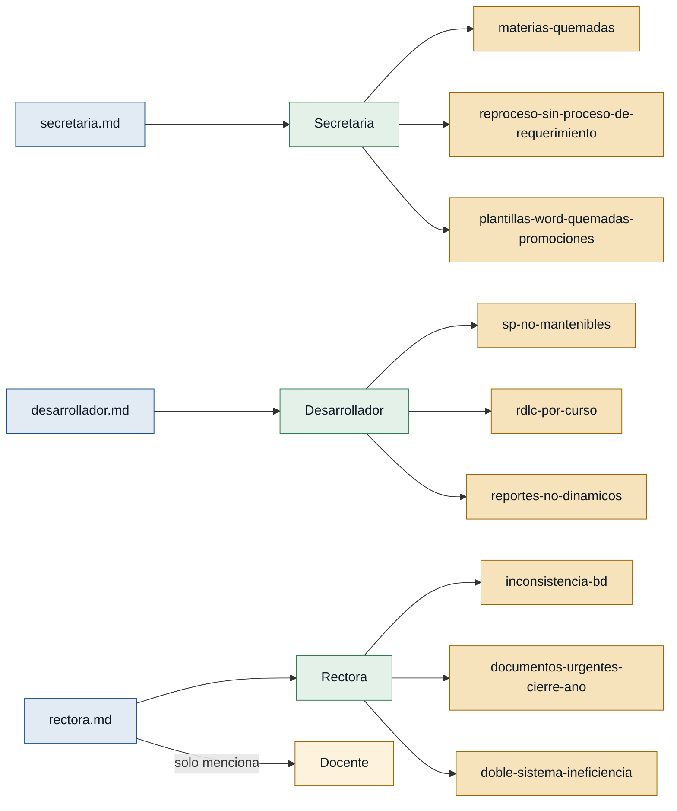

# Personas — Ciencia y Fe

---

## Personas (actores con entrevista propia)

### Secretaria — secretaria
- **Contexto:** funcionaria de secretaría de la institución educativa; usa el sistema para generar y verificar cuadros de calificaciones (trimestrales, finales) y reportes de promociones destinados al distrito.
- **Objetivo principal:** disponer de reportes correctos, coherentes y a tiempo, sin tener que devolverlos repetidamente por errores.
- **Dolores:**
  - Los nombres de las materias en los reportes RDLC están quemados manualmente y no coinciden con la base de datos. (`secretaria.md`)
  - Arreglar un reporte rompe otro por inconsistencias en la BD y en los SP. (`secretaria.md`)
  - Las materias de los reportes de promoción deben coincidir con los cuadros de calificación, pero el llenado es por posicionamiento y genera inconsistencias. (`secretaria.md`)
  - No existe un proceso claro para solicitar cambios: los requerimientos se malinterpretan, se invierten semanas y después hay que revertir. (`secretaria.md`)
  - Los documentos de cierre 2025-2026 deben entregarse urgentemente al distrito con firmas y sellos. (`secretaria.md`, `rectora.md`)
- **Respaldo:** `primera mano` — entrevista `secretaria.md`.

---

### Desarrollador — desarrollador
- **Contexto:** equipo de dos desarrolladores (D1 y D2) que mantienen el sistema académico .NET/SQL Server y construyen en paralelo el sistema nuevo.
- **Objetivo principal:** entregar los reportes urgentes con el sistema actual y avanzar en un sistema nuevo mantenible.
- **Dolores:**
  - SP de hasta 30 000 líneas con `if` anidados; un SP llama a otro; corregir uno rompe otro. (`desarrollador.md`)
  - Cada curso tiene su propio RDLC; el editor no es amigable y mover un elemento desacomoda todo el reporte. (`desarrollador.md`)
  - Los nombres de materias están quemados en RDLC y plantillas Word; no coinciden con la BD, lo que impide hacer reportes dinámicos. (`desarrollador.md`)
  - Las diez plantillas Word de promociones tienen materias quemadas y el llenado es por posicionamiento, sin lógica de datos. (`secretaria.md`)
  - Sin estandarización: cada curso tiene plantillas distintas; modificar uno requiere cambios en múltiples archivos. (`desarrollador.md`)
- **Respaldo:** `primera mano` — entrevista `desarrollador.md`.

---

### Rectora — rectora
- **Contexto:** directora de la institución educativa; define las prioridades del sistema, coordina con los desarrolladores y responde ante el Ministerio de Educación y el distrito.
- **Objetivo principal:** garantizar los entregables urgentes de cierre de año 2025-2026 y luego reemplazar el sistema actual por uno mantenible.
- **Dolores:**
  - El sistema tiene código no mantenible: SP de 30k líneas, BD sin esquema centralizado y consultas mal generadas. (`rectora.md`)
  - No existe una sola tabla de calificaciones; la información está dispersa en tablas sin esquema claro. (`rectora.md`)
  - El Ministerio de Educación cambia sus lineamientos y no ha existido un estándar; cada cambio obliga a modificar múltiples archivos por curso. (`rectora.md`)
  - Hay dos sistemas (interno y externo) que generan ineficiencia; la rectora quiere dar de baja el externo. (`rectora.md`)
- **Respaldo:** `primera mano` — entrevista `rectora.md`.

---

### Docente — docente
- **Contexto:** docentes de la institución, mencionados como firmantes de los cuadros de calificaciones y reportes enviados al distrito.
- **Objetivo principal:** no evidenciado; no existe entrevista propia.
- **Dolores:** sin evidencia de primera mano.
- **Respaldo:** `referenciada` — mencionado en `rectora.md`; no existe entrevista de primera mano.

---

## Stakeholders

### Ministerio de Educación
- **Interés en el sistema:** define los lineamientos académicos y los estándares documentales que el sistema debe cumplir; sus cambios frecuentes obligan a actualizaciones en plantillas y lógica de reportes.
- **Fuente:** `rectora.md`, `secretaria.md`.

### Distrito educativo
- **Interés en el sistema:** receptor oficial de los cuadros de calificaciones y reportes de promociones firmados y sellados; exige los documentos en los plazos establecidos.
- **Fuente:** `secretaria.md`, `rectora.md`.
