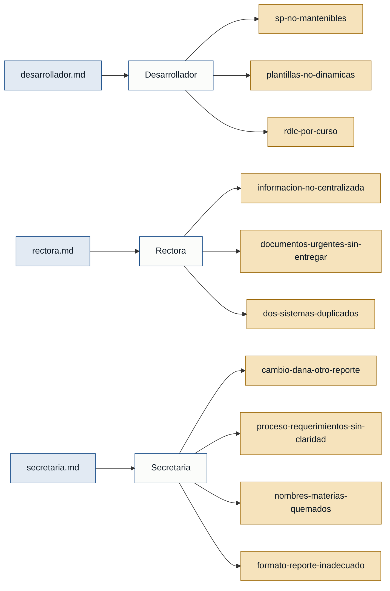

# Personas y Stakeholders — Ciencia y Fe

---

## Mapa de trazabilidad

---

## Personas

### Desarrollador — desarrollador
- **Contexto:** Técnico encargado de mantener y evolucionar el sistema académico de la institución; actualmente hay dos desarrolladores con responsabilidades divididas (cuadros/trimestrales uno; promociones e infraestructura el otro).
- **Objetivo principal:** Entregar los reportes académicos urgentes del período 2025-2026 y construir un sistema nuevo, mantenible y centralizado que reemplace el actual.
- **Dolores:**
  - Los stored procedures tienen hasta 30 000 líneas con `if` anidados; un SP llama a otro y arreglar uno rompe otro. (`desarrollador.md`)
  - Cada curso tiene su propio RDLC; el editor RDLC no es amigable y cualquier movimiento desplaza todo el layout. (`desarrollador.md`)
  - Los nombres de las materias están "quemados" en los RDLC y en las plantillas Word; no se pueden hacer dinámicos sin romper la coincidencia de datos. (`desarrollador.md`)
  - El llenado de las plantillas Word de promociones se hace por posicionamiento, sin lógica de negocio. (`secretaria.md`)
  - Los requerimientos llegan sin especificación clara, lo que genera reversiones y pérdida de tiempo. (`secretaria.md`)
- **Respaldo:** `primera mano` (`desarrollador.md`, `primera_persona: true`)

---

### Rectora — rectora
- **Contexto:** Máxima autoridad de la institución educativa; define prioridades, supervisa a los desarrolladores y gestiona los compromisos con el Ministerio de Educación y el distrito.
- **Objetivo principal:** Garantizar la entrega oportuna de los documentos académicos del período 2025-2026 y liderar la transición a un sistema académico nuevo y conforme a la normativa.
- **Dolores:**
  - El código actual no es mantenible; queries mal generados y SP de 30 000 líneas dificultan cualquier cambio. (`rectora.md`)
  - La información no está centralizada: no existe un único esquema de BD ni una tabla unificada de calificaciones. (`rectora.md`)
  - Los SP no se reutilizan: se crea uno nuevo por cada variante, multiplicando el problema. (`rectora.md`)
  - Las plantillas de cuadros y promociones deben editarse manualmente archivo por archivo cuando el Ministerio cambia los lineamientos. (`rectora.md`)
  - Existen dos sistemas (interno y externo) con duplicidad de mantenimiento que se quiere eliminar. (`rectora.md`)
  - Los documentos urgentes del período 2025-2026 (cuadros trimestrales, finales y promociones) deben firmarse y sellarse por el distrito, y aún no están listos. (`rectora.md`)
- **Respaldo:** `primera mano` (`rectora.md`, `primera_persona: true`)

---

### Secretaria — secretaria
- **Contexto:** Responsable administrativa de la secretaría escolar; recibe, revisa y aprueba los reportes académicos antes de enviarlos al distrito.
- **Objetivo principal:** Obtener cuadros de calificaciones y reportes de promoción correctos, con formatos que cumplan los requisitos del distrito (firmas, sellos, escalas correctas por nivel).
- **Dolores:**
  - Los nombres de las materias en los reportes no coinciden con los guardados en la BD; están puestos manualmente. (`secretaria.md`)
  - Corregir un reporte daña otro: al arreglar el cuadro trimestral se mueve el de promoción o viceversa. (`secretaria.md`)
  - Los cuadros de comportamiento y sus escalas aparecen demasiado grandes en el reporte, ocultando la información principal. (`secretaria.md`)
  - Falta espacio designado para las firmas del docente y los dos sellos (colegio y distrito). (`secretaria.md`)
  - El cuadro final no siempre coincide con el reporte de promoción. (`secretaria.md`)
  - No existe un proceso claro para comunicar requerimientos de cambio; las especificaciones llegan ambiguas y se generan reversiones. (`secretaria.md`)
- **Respaldo:** `primera mano` (`secretaria.md`, `primera_persona: true`)

---

## Stakeholders

### Distrito educativo
- **Interés en el sistema:** Recibe los cuadros y reportes de promoción firmados y sellados. Exige que la información sea correcta y que los documentos cumplan el formato oficial antes de su ingreso.
- **Fuente:** `secretaria.md`, `rectora.md`

### Ministerio de Educación
- **Interés en el sistema:** Define los lineamientos académicos y puede cambiarlos, lo que obliga a actualizar plantillas y lógica de calificaciones. Sus normas determinan las escalas por nivel y los documentos que la institución debe entregar.
- **Fuente:** `rectora.md`

### Docentes
- **Interés en el sistema:** Firman los cuadros de calificaciones y reportes de promoción antes de que se entreguen al distrito. No hay evidencia de que usen el sistema directamente.
- **Fuente:** `rectora.md` (mencionados, no entrevistados)
